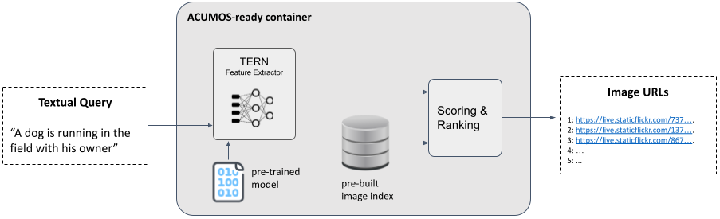

# Text to Visual Search Tool (AI4EU Component)



This repository collects the code for building the Text to Visual search component for use in Acumos. It is compliant with the [AI4EU](https://www.ai4europe.eu/) specifications.
This code enables to do the following things:
- Extract visual features from a given image folder
- Construct an image index using [FAISS](https://github.com/facebookresearch/faiss)
- Building the Acumos-ready docker images, with gRPC interfaces.

This code is based on the [TERN](https://github.com/mesnico/TERN) and [TERAN](https://github.com/mesnico/TERAN) cross-modal retrieval frameworks, published respectively at ICPR 2020 and ACM Transaction on Multimedia (TOMM) 2021.

## Installation
You need [Conda](https://docs.conda.io/en/latest/) and [Docker](https://docs.nvidia.com/datacenter/cloud-native/container-toolkit/install-guide.html#docker) (with Nvidia Container Toolkit).

Then, download this repo and move into it:
```
git clone https://github.com/mesnico/ai4eu-text-to-visual-component
cd ai4eu-text-to-visual-component
```

Install the python dependencies in the conda environment and activate it:
```
conda env create --file environment.yml
conda activate ai4eu
export PYTHONPATH=.
```

## Image Features Extraction
You can pull the following docker image for extracting bottom up features from the images.
```
docker pull mesnico/bottom-up-extractor
```
At this point, you can follow the instructions reported [here](https://hub.docker.com/r/mesnico/bottom-up-extractor) to run the docker.
In the end of this process, you will find the extracted features in `OUT_PATH/bu_features.tsv.0`

You then need to run the following code to convert the bottom up features to a suitable format:
```
python bu_features_convert.py --in_file OUT_PATH/bu_features.tsv.0 --output_dir OUT_PATH/bu_features
```

## Image Indexing
The next step is to extract and index the TERN cross-modal features. 
First, you must download and unzip the TERN model files into the project root:
```
wget http://datino.isti.cnr.it/tern/ai4eu_tern_data.tar
tar -xvf ai4eu_tern_data.tar
```

Then, you can run the extraction and indexing code (`OUT_PATH` is the directory where the folder `bu_features` resides)
```
python index_bu_features.py --features_dir OUT_PATH/
```
In the end of this process, you should find a folder `faiss_index` in the project root, with the necessary index FAISS files inside.
### Customize the URLs in the index
Actually, the default image URLs used to build the index are merely the original image names (without extension). You could customize the generation of the URL given the image name by modifying the `ids_to_urls(ids)` function implementation in `index_bu_features.py`.
This is useful to retrieve the found images from a remote web server running in the Internet.

## Test the gRPC interface
If you want to test the retrieval system, comprised of the gRPC interfaces, you can start the gRPC server:
```
python app.py
```
Then, you can perform a toy call to this server using the following script:
```
python client_test.py --query "A tennis player serving the ball on the court"
```
If all goes well, this script should print the URLs of the images most similar to the given query text.

## Packing the Acumos-ready Docker
You can pack the component with the built image index into an Acumos-ready docker image, which exposes the gRPC interfaces.
```
docker build -t text-to-visual-search-component .
```
The built image can be uploaded to [DockerHub](https://hub.docker.com/) and then onboarded on [AI4EU Acumos](https://aiexp.ai4europe.eu/).